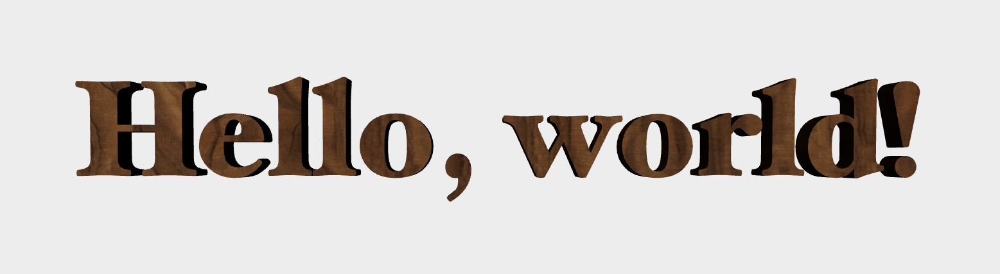

# Rendering Extruded 3D Text with Core Text, libtess2, and MetalKit

This repository contains the sample code for the [_Rendering 3D Text with Core Text and libtess2_](http://metalbyexample.com/text-3d/) article on _Metal by Example_.

